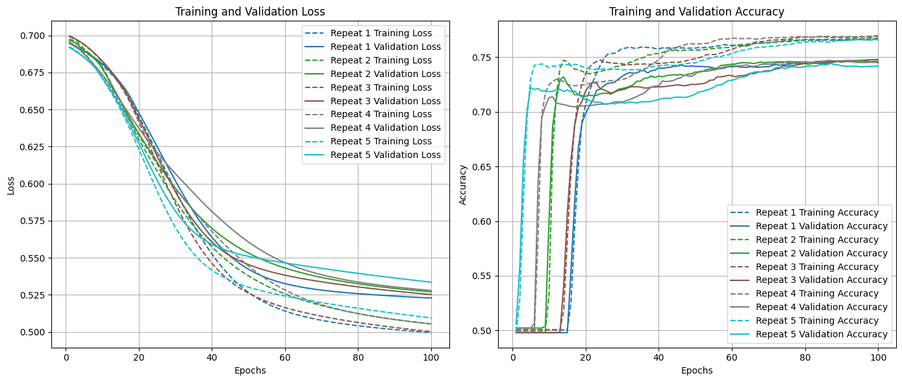
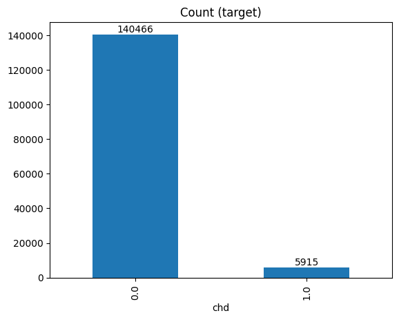
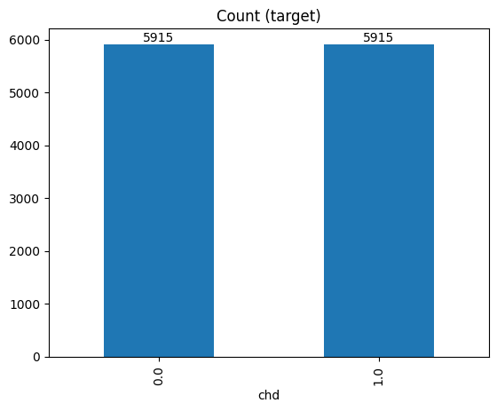

# Risk prediction for Coronary Heart Disease 
Dataset downloaded from Kaggle example [Behavioral Risk Factor Surveillance System](https://www.kaggle.com/datasets/cdc/behavioral-risk-factor-surveillance-system/data)

CNN model was adapted from: 
> Soumyabrata Dev, Hewei Wang, Chidozie Shamrock Nwosu, Nishtha Jain, Bharadwaj Veeravalli, and Deepu John, A predictive analytics approach for stroke prediction using machine learning and neural networks, Healthcare Analytics, 2022.

# Steps

## 1. Data Cleaning

## 2a. Design and implement convolutional neural network in Python

## 2b. Compare machine learning models in R

# Selected variables
<u>Target Variable</u>
- coronary heart disease: `chd`

<u>Predictor Variables</u>

Demographic variables

    - sex: `sex`
    - race: `race`
    - age: `age5y`
    - marital status: `ever_married`

Socioeconomic status variables

    - education: `education`
    - income: `income``
    - employment: `employment` 

Health variables

    - diabetes: `diabetes`
    - hypertension: `hypertension`
    - BMI: `BMI`

Health-related risk behaviors

    - smoking status: `smoke`
    - vegetable consumption: `vegetable`
        - *Consume Vegetables 1 or more times per day*
    - fruit consumption: `fruit`
        - *Consume Fruit 1 or more times per day*
    - binge drinking times in the past month: `binge_drink`
        - *Considering all types of alcoholic beverages, how many times during the past 30 days did you have 5 or more drinks for men or 4 or more drinks for women on an occasion?*
    - exercise times in the past month: `exercise`
        - *During the past month, other than your regular job, did you participate in any physical activities or exercises such as running, calisthenics, golf, gardening, or walking for exercise?*

# Results 
## CNN performance metrics for each repeat 
| Model               |   Repeat 1 |   Repeat 2 |   Repeat 3 |   Repeat 4 |   Repeat 5 |    Average |
|:--------------------|-----------:|-----------:|-----------:|-----------:|-----------:|-----------:|
| Precision           | 0.767132   |   0.771517 | 	0.778195 |	0.770552  |	0.772128   |    0.771905|
| Recall              | 0.709877   |   0.699214 |   0.696970 |  0.704826  | 0.690236   |    0.700224|
| F-score             | 0.737394   |   0.733588 |	0.735346 |	0.736225  |	0.728889   |	0.734289|
| Accuracy            | 0.746126   |   0.744999 |	0.748098 |	0.746407  |	0.742181   |	0.745562|
| Miss Rate           | 0.195242   |   0.202723 |	0.203390 |	0.198565  |	0.209567   |	0.201897|
| Fall out rate       | 0.217317   |   0.208829 |	0.200340 |	0.211658  |	0.205433   |	0.208715|

## Evaluation: Loss and Accuracy Plots

# Limitations

## Outcome Variable

The data had an imbalance between those that have coronary heart disease cases and those that do not. Without balancing data, we risk training a model that would predict non-cases better. Selected dataset must be downsampled to create balanced data for training. 

## Sample Size

The original BRFSS data included 441456 questionnaire answers of 330 varaibles. The final balanced data was reduced to 11830 rows of data that included 1 target variable and 15 predictor variables due to unanswered questtions and excluded categories in some variables. 

## Kernel Size

Kernel size of the second convolutional layer was changed from 2x2 to 3x2. 

## Interpretability

Although this project shows that results are reproducible, it is difficult to interpret the model in terms of variable importance to explain the prediction decisions of the model. 

# Decisions & Trade-offs

## Variable recoding

Some variables were regrouped, which may lead to a decrease in resolution. 

1. Hypertension and diabetes: Females who were only told to have the condition during pregnancy and those who were told to be borderline high risk for the conditions were excluded. 

2. Marriage status: Marriage status were grouped into 0 = never married or 1 = have married.

3. Smoking: Smoking was recoded into variable with 3 categories (never smoked, current smoker, former smoker). 

## Learning rate

Learning rate of the optimizer was decreased from 1e-4 in the original model to 1e-5. This may lead to more training time. However, 100 epochs has been shown to be enough to reach a plateau in accuracy. 

