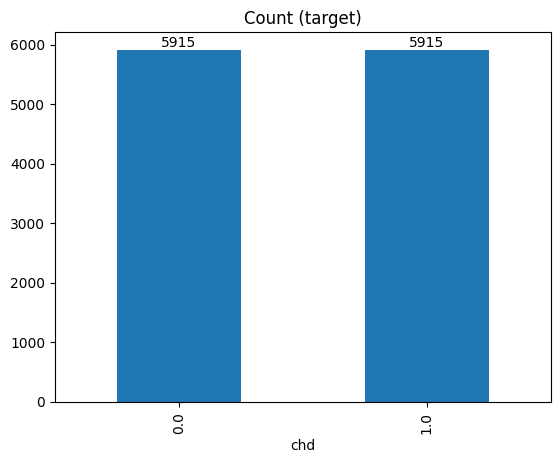

# Risk prediction for Coronary Heart Disease 
Dataset downloaded from Kaggle example [Behavioral Risk Factor Surveillance System](https://www.kaggle.com/datasets/cdc/behavioral-risk-factor-surveillance-system/data)

CNN model was adapted from: 
> Soumyabrata Dev, Hewei Wang, Chidozie Shamrock Nwosu, Nishtha Jain, Bharadwaj Veeravalli, and Deepu John, A predictive analytics approach for stroke prediction using machine learning and neural networks, Healthcare Analytics, 2022.

## 1. Data Cleaning

**Code:** [Clean_Data.ipynb](data_cleaning/Clean_Data.ipynb)

**Description:** Variables were selected, cleaned, and downsampled using for subsequent model training.

<u>Predictor Variables</u> : include variables that describe *demographics*, *socioeconomic status*, *comorbidities*, and *health-related risk behaviors*

-   *Demographic variables*: sex (`sex`), race (`race`), age (`age5y`), marital status (`ever_married`)

-   *Socioeconomic status variables*: education (`education`), income (`income`), employment (`employment`)

-   *Comorbidities*: diabetes (`diabetes`), hypertension: (`hypertension`), BMI (`BMI`)

-   *Health-related risk behaviors*: smoking status (`smoke`), vegetable consumption (`vegetable`), binge drinking(`binge_drink`), exercise (`exercise`)

<u>Outcome Variable</u>: Coronary Heart Disease (`chd`)

The data had an imbalance between those that have coronary heart disease cases and those that do not. Without balancing data, we risk training a model that would predict non-cases better. Selected dataset must be downsampled to create balanced data for training. 

**Result:** The original BRFSS data included 441456 questionnaire answers of 330 varaibles. The final balanced data was reduced to 11830 rows of data that included 1 target variable and 15 predictor variables due to unanswered questtions and excluded categories in some variables. 

## 2a. Design and implement convolutional neural network (CNN) in Python

### Results 

#### CNN performance metrics for each repeat 

|               |   Repeat 1 |   Repeat 2 |   Repeat 3 |   Repeat 4 |   Repeat 5 |   Average |
|:--------------|-----------:|-----------:|-----------:|-----------:|-----------:|----------:|
| Precision     |   0.802118 |   0.800131 |   0.800656 |   0.8      |   0.796272 |  0.799835 |
| Recall        |   0.696152 |   0.703619 |   0.701321 |   0.705342 |   0.71166  |  0.703619 |
| F-score       |   0.745387 |   0.748778 |   0.747704 |   0.749695 |   0.751592 |  0.748631 |
| Accuracy      |   0.766695 |   0.768385 |   0.767822 |   0.768949 |   0.769231 |  0.768216 |
| Miss Rate     |   0.194414 |   0.189219 |   0.190826 |   0.187981 |   0.183883 |  0.189264 |
| Fall out rate |   0.165376 |   0.169248 |   0.168142 |   0.169801 |   0.175332 |  0.16958  |

#### Evaluation: Loss and Accuracy Plots

## 2b. Compare machine learning models in R

**Aim:** Create a cost-effective and personalized machine learning model for predicting coronary heart disease (CHD) risk using non-clinical data

**Introduction:** This project aims to predict coronary heart disease (CHD) risk using data from the 2015 Behavioral Risk Factor Surveillance System (BRFSS) survey. Key risk factors for CHD, including demographic, socioeconomic, health, and behavioral variables, were used to build predictive models. The project focused on balancing the dataset and applying machine learning techniques such as decision trees, random forests, and XGBoost to improve prediction accuracy and interpretability.

**Results:**

 -   XGBoost was identified as the best-performing model, with \~75.4% accuracy, 73.5 % precision, 79.5% recall and 76.3% F1-score. Recall was the the most crucial metric, indicating its potential as a pre-clinical screening model for early CHD risk detection and intervention.
    
-   Feature importance analysis showed that age, hypertension, and employment were among the most important predictors across models.

